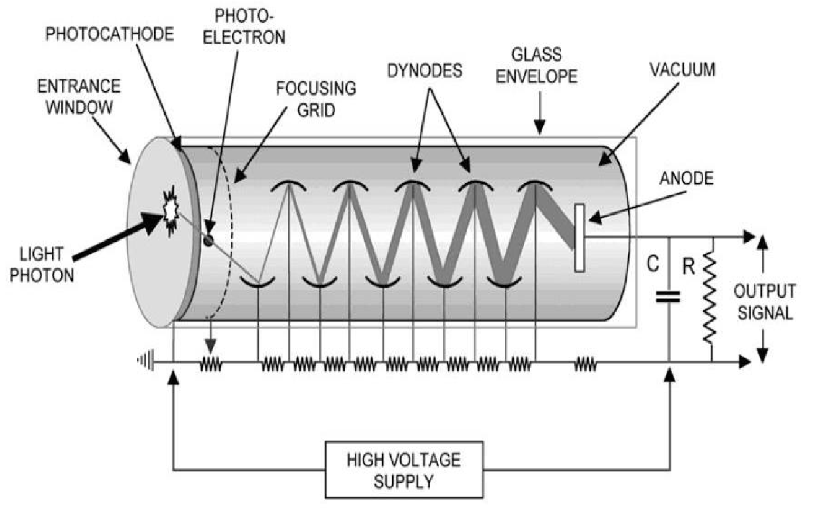

# Table of Contents

1.  [介绍](#org612bf7f)
    1.  [人身与设备安全](#org7846196)
    2.  [目标和最终要求](#orgc2535a4)
    3.  [实验内容](#orgd866aa5)
    4.  [Reference](#org1019c13)
    5.  [分组与考核](#orgc92d81d)
2.  [预前知识](#org66b1465)
    1.  [&mu;](#org85dd140)
3.  [探测器性质与基本信号特征实验](#org68379f4)
    1.  [参数](#org809600c)
    2.  [装置](#org9d70035)
        1.  [PMT](#org551f6c7)
    3.  [实验结果](#org3ab09d1)
        1.  [热噪声频率](#orgc929fab)
        2.  [信号计数率](#org566a25b)
        3.  [衰减长度](#org182084d)
4.  [物理实验 1: 测量 &mu; 通量和角分布](#orgc7719a3)
5.  [物理实验 2: 测量 &mu; 寿命](#orgdf4ce79)
6.  [物理实验 3: Michael 电子能谱测量](#org4cc6c78)
7.  [References](#org78b76fe)

# 介绍

## 人身与设备安全

-   PMT 在遮光条件下使用；
-   PMT 使用 1500V 左右高压，一般不超过 1900V.

## 目标和最终要求

经历一个完整的高能物理实验，学习和感受全过程。

## 实验内容

-   基础
-   探测器性质与基本信号特征实验
-   物理实验

## Reference

-   <https://hep.tsinghua.edu.cn/training/cosmicRay/index.html>

## 分组与考核

-   2 人一组
-   约时间进行实验，先讨论实验方案，可行后才可进行
-   至少保证每周 2 小时
-   4 次报告，每两周一次
-   每个组都要介绍实验进展，每组两个人交替报告
-   按照报告结果、实验投入程度、研究和学习深度打分，期中结束并算总分

# 预前知识

## &mu;

1.  宇宙射线在大气中碰撞产生 &pi;，并很快衰变产生 &mu;.
2.  &mu; 质量大，穿越大气时的能量损失少。
3.  不一样。质子和 &alpha; 占绝大部分。
4.  寿命约为 2.2 &mu; s, 且速度接近光速，寿命显著延长。
5.  天顶角决定了 &mu; 穿越大气层的路径长度，路径越长，反应和衰变的概率越大。
6.  Muons lose energy at a fairly constant rate of about 2 MeV per g/cm2. 只考虑电离损失：
    
    $$\Delta E = s \times \rho \times \delta E \approx 14\mathrm{TeV}.$$

# 探测器性质与基本信号特征实验

测量暗噪声（事例率、波形、特征参数）和电子学噪声，&mu; 信号（宇宙线望远镜、事例率、波形、特征参数），闪烁体能量响应、衰减长度和探测效率。

## 参数

-   &mu; 在闪烁体中的最小电离能: 1.936 MeV cm2 g-1
-   闪烁体密度: 1.03 g cm-3
-   闪烁体宽度：15.5cm
-   闪烁体长度：60.5cm
-   闪烁体厚度：5.0cm

## 装置

### PMT

飞利浦 XP2020

$$i_{dark} \sim T^{5/4}e^{-\frac{e\psi}{kT}}.$$

结构包含采光面窗口、光阴极、电子倍增部分和后部的分压器、读出与基座部分。

## 实验结果

### 热噪声频率

<table border="2" cellspacing="0" cellpadding="6" rules="groups" frame="hsides">

<colgroup>
<col  class="org-right" />
</colgroup>
<thead>
<tr>
<th scope="col" class="org-right">热噪声频率（Hz）</th>
</tr>
</thead>

<tbody>
<tr>
<td class="org-right">22.6</td>
</tr>

<tr>
<td class="org-right">15.3</td>
</tr>

<tr>
<td class="org-right">15.5</td>
</tr>

<tr>
<td class="org-right">13.7</td>
</tr>

<tr>
<td class="org-right">17.8</td>
</tr>

<tr>
<td class="org-right">19.1</td>
</tr>

<tr>
<td class="org-right">14.0</td>
</tr>

<tr>
<td class="org-right">13.1</td>
</tr>

<tr>
<td class="org-right">15.2</td>
</tr>

<tr>
<td class="org-right">16.4</td>
</tr>

<tr>
<td class="org-right">20.1</td>
</tr>

<tr>
<td class="org-right">16.0</td>
</tr>

<tr>
<td class="org-right">20.9</td>
</tr>

<tr>
<td class="org-right">15.2</td>
</tr>

<tr>
<td class="org-right">17.7</td>
</tr>

<tr>
<td class="org-right">12.0</td>
</tr>

<tr>
<td class="org-right">17.4</td>
</tr>

<tr>
<td class="org-right">21.1</td>
</tr>

<tr>
<td class="org-right">13.6</td>
</tr>

<tr>
<td class="org-right">12.4</td>
</tr>

<tr>
<td class="org-right">16.2</td>
</tr>

<tr>
<td class="org-right">16.8</td>
</tr>

<tr>
<td class="org-right">19.4</td>
</tr>

<tr>
<td class="org-right">15.6</td>
</tr>

<tr>
<td class="org-right">11.7</td>
</tr>

<tr>
<td class="org-right">15.1</td>
</tr>

<tr>
<td class="org-right">14.9</td>
</tr>

<tr>
<td class="org-right">16.9</td>
</tr>

<tr>
<td class="org-right">16.1</td>
</tr>

<tr>
<td class="org-right">15.1</td>
</tr>

<tr>
<td class="org-right">13.3</td>
</tr>

<tr>
<td class="org-right">18.9</td>
</tr>

<tr>
<td class="org-right">16.5</td>
</tr>

<tr>
<td class="org-right">19.1</td>
</tr>

<tr>
<td class="org-right">12.0</td>
</tr>

<tr>
<td class="org-right">19.0</td>
</tr>

<tr>
<td class="org-right">11.9</td>
</tr>

<tr>
<td class="org-right">14.6</td>
</tr>

<tr>
<td class="org-right">12.9</td>
</tr>

<tr>
<td class="org-right">13.7</td>
</tr>

<tr>
<td class="org-right">15.8</td>
</tr>

<tr>
<td class="org-right">18.2</td>
</tr>

<tr>
<td class="org-right">13.5</td>
</tr>

<tr>
<td class="org-right">17.0</td>
</tr>

<tr>
<td class="org-right">17.8</td>
</tr>
</tbody>
</table>

### 信号计数率

599 hits min-1.

### 衰减长度

# 物理实验 1: 测量 &mu; 通量和角分布

# 物理实验 2: 测量 &mu; 寿命

# 物理实验 3: Michael 电子能谱测量

# References

1.  <https://era.library.ualberta.ca/items/10813ee8-3b2e-416c-88d2-62ebc976b606/view/648bb639-4b0b-448f-9042-80818bc9fa6a/Singhrao_Kamal_201509_MSc.pdf>
2.  <https://cosmic.lbl.gov/SKliewer/Cosmic_Rays/Muons.htm>

